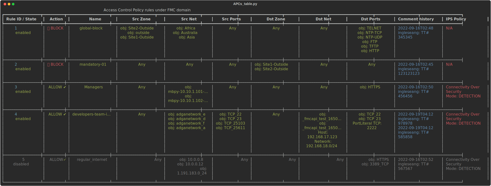
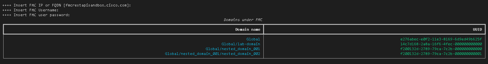
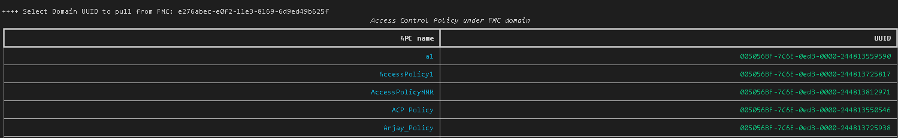

# Cisco FMC Excel and SVG from Firepower API

[](https://developer.cisco.com/codeexchange/github/repo/AngelIV23/cisco-fmc-excel-from-json)


# Installation for debian-based OS
Virtual Environment

We recommend running this application in a Python virtual environment while testing or developing. This will help keep your host system clean and allow you to have multiple environments to try new things. If you are not using a virtual environment, start at the download/clone step below.

You will also need Python 3, pip, and venv installed on your host system.

In your project directory, create your virtual environment
``` console
python3 -m venv myvenv
```
Activate (use) your new virtual environment (Linux):
``` console
source myvenv/bin/activate
```
Download or clone the cisco-fmc-excel-from-json repository:

``` console
git clone https://github.com/AngelIV23/cisco-fmc-excel-from-json.git
```

Install Python packages using pip according to the requirements.txt file
```
pip install -r requirements.txt
```
If needed, you can create optionally the next folders depending on current requirements and code tweaks you'd like to make:
```
mkdir outputs
```

To test the code, you can easily get a temporary username and password and play around with API calls using the Cisco Firepower Management Center Get Hands-On section:

https://developer.cisco.com/secure-firewall/

## Application walkthorugh:

1. Run the main script which will automatically gather data from corresponding key (by default, Meraki API is being used):
```
python main_fmc2csv.py
```

2. Follow the steps described in the session which will request the corresponding UUID per layer:


3. Output files under outputs folder :)
